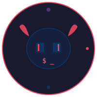

<p align="center">
  
</p>

<h3 align="center">claude-daemon</h3>
<p align="center">Claude Code forgets everything between sessions.<br/>This system makes it remember.</p>

---

## The problem

```
 Session 1                         Session 2
 ┌────────────────────┐            ┌────────────────────┐
 │  12 hours of work  │            │  Who am I?         │
 │  Bugs found        │──(lost)──▶ │  What project?     │
 │  Decisions made    │            │  Start over.       │
 │  Lessons learned   │            │                    │
 └────────────────────┘            └────────────────────┘
```

Sessions die. Context vanishes. Subagents ignore your instructions. Nobody reviews the work while you sleep. Lessons from failures evaporate.

## The fix

```
 Session 1                         Overnight                    Session 2
 ┌──────────────┐                  ┌──────────────┐            ┌──────────────────────┐
 │ Your work    │─── hooks ───────▶│ meta-agent   │──────────▶ │ Morning briefing:    │
 │              │  capture:        │ (opus, 3am)  │            │ "3 things happened.  │
 │              │  • prompts       │ reviews it   │            │  Here's what to fix. │
 │              │  • tool traces   │ all, updates │            │  PR #18 needs merge."│
 │              │  • decisions     │ the brain    │            │                      │
 │              │  • failures      │              │            │ Subagents know your  │
 │              │  • digests       │              │            │ design decisions.    │
 └──────────────┘                  └──────────────┘            └──────────────────────┘
```

## How it works

**18 hooks run silently every session:**

```
 You type a prompt
  │
  ├──▶ prompt captured (intent is the signal)
  ├──▶ design decisions extracted for subagents
  │
 Claude works
  │
  ├──▶ every tool call traced
  ├──▶ failures auto-captured as lessons
  ├──▶ subagents get your decisions injected (0.05s)
  │
 Session ends
  │
  ├──▶ session distilled to 3-line digest
  ├──▶ compaction survival logged
  └──▶ persist mode: blocks stop until goal is done
```

**Nightly pipeline runs while you sleep:**

```
 3:00am ── signals + meta-agent review (opus)
 5:30am ── Claude Code docs diff (catch new features)
 6:00am ── changelog analysis (adopt or remove)
 7:30am ── opportunity scanner → email
```

## The subagent fix

This was the pain that started it all:

```
 Before                              After
 ──────                              ─────

 You: "use shadcn registry"          You: "use shadcn registry"
       │                                   │
       ▼                                   ▼
 Subagent can't see                  Hook extracts decision,
 your conversation                   caches it (async, background)
       │                                   │
       ▼                                   ▼
 Hand-rolls everything               Subagent reads cache (0.05s)
       │                             Sees: "use shadcn registry"
       ▼                                   │
 You: "I said use shadcn!"                 ▼
                                     Uses shadcn ✓
```

Design decisions extracted after every prompt. Injected into every subagent. No delay.

## Quick start

```bash
git clone https://github.com/williavs/claude-daemon-system.git ~/claude-daemon
cd ~/claude-daemon
./cd-setup
```

## Commands

| Command | What it does |
|---------|-------------|
| `cd-status` | Dashboard: tasks, budget, circuit breaker |
| `cd-persist on "goal"` | Don't let Claude stop until done |
| `cd-briefing` | Show today's morning briefing |
| `cd-score` | System health + improvement signal (real metrics, not self-review) |
| `cd-tokens` | Where your tokens go (hint: subagents) |
| `cd-feedback good "reason"` | Rate today's idea, scanner learns |
| `cd-cost` | Daemon cost breakdown |
| `cd-review` | Full performance dashboard |
| `cd-docs-watch` | Diff Claude Code docs, catch new features |
| `cd-real-cost` | Compute actual cost of a claude -p call routed through LiteLLM |

## LiteLLM routing (optional, 6x cheaper)

Claude Code respects `ANTHROPIC_BASE_URL` + `ANTHROPIC_AUTH_TOKEN`. Point those at a LiteLLM proxy and you can route all daemon calls through Gemini, Groq, or any provider with an Anthropic-compatible `/v1/messages` endpoint.

```json
"litellm": {
  "enabled": true,
  "url": "http://localhost:4000",
  "key": "sk-your-litellm-master-key",
  "model": "gemini-3-flash"
}
```

When enabled, `resolve_model()` routes haiku/sonnet/opus requests to your configured model. `cd-real-cost` queries LiteLLM's `/model/info` for actual rates (Claude Code reports fake Anthropic rates -- you need this to see real spend).

**Real cost comparison** from our production runs:

| Component | Claude direct | LiteLLM + Gemini-3-flash | Savings |
|---|---|---|---|
| Daemon task | $0.12-0.24 | $0.02-0.06 | 4-6x |
| Opportunity scan | $0.40-0.55 | $0.09 | 5-6x |
| Meta-agent nightly | $3-4 (when it didn't crash) | ~$0.20 | 15-20x |

## Scoring

`cd-score` tracks real metrics, not self-assessment:

```
System Health  (production since 2026-04-07, day N)
  ██████████░░░░░░░░░░ 52/100

  Task Quality           ███████░░░  75.0  tasks with real output / total
  Scan Conviction        ███░░░░░░░  33.3  your feedback verdicts
  Cost Efficiency        ███░░░░░░░  30.0  daily spend vs baseline
  Nightly Reliability    ███████░░░  75.0  nights with meta + signals
  Error Learning         ███░░░░░░░  38.0  fix rate vs recurring errors
```

Components only score when they have enough data (minimum 7 tasks, 5 rated scans, 3 days of cost data). "Insufficient data" is a valid answer.

The daemon is a rounding error. Your interactive sessions and subagents are the real cost. `cd-tokens` shows you exactly where.

## Config

Everything is optional. Start with hooks only, add nightly pipeline later.

```bash
cp config.template.json config.json
# Edit: email, searxng (optional), fleet (optional), scan model
```

## Design principles

Built on the [effective-claude](program.template.md) methodology:

| Principle | What it means |
|-----------|--------------|
| Consumer backwards | Each stage reduces 80%. Traces → digests → briefing → 3 bullets |
| Match model to task | Haiku for scans ($0.005). Opus for the brain |
| Halt, don't flail | Circuit breakers everywhere. Budget caps. Max loops |
| Persist intent, not noise | Your prompts are the signal. Raw tool calls are not |

---

<p align="center">
  <sub>bash + <code>claude -p</code>. no frameworks. no databases. just files.</sub>
</p>
